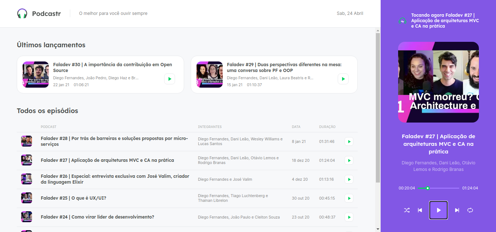
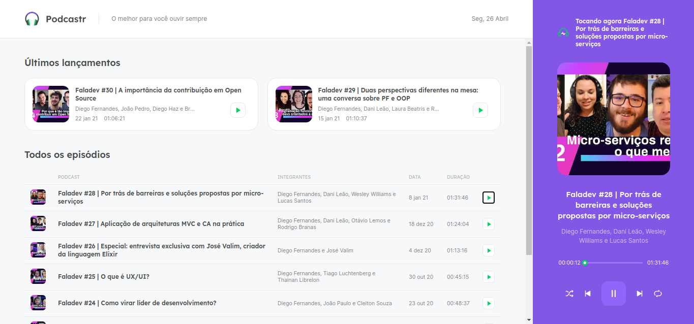
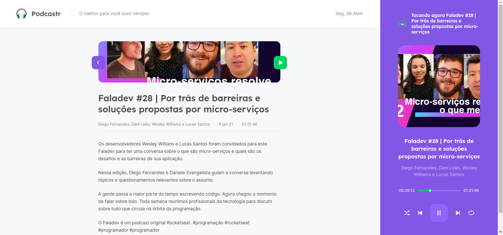

# Mini curso de uma semana da Rocketseat

## NLW#05

## O que foi feito no curso

Quando comecei o curso eu queria aprender sobre contextos e passagem de parametros entre componentes (entre filhos e pais) 
eu não consegui pegar esse conceito vendo a documentação, fiquei intrigado então quando vi um player como resultado de projeto 
imaginei que isso iria ser usado então descidi fazer o curso. No final eu consegui aprender sobre contextos e tive uma base pra 
iniciar os estudos em NextJS o que me deixou muito animado.

## O que quero fazer com o projeto (Quando eu tiver com tempo)

  Quero deixar ele responsivo que é uma das coisas sugeridas no curso, 
  além disso quero fazer uma api real com algum tipo de cadastro de podcasts, 
  ficaria mais interessante a possibilidade de adicionar novos podcasts e me ajudaria a aprender mais sobre 
  nodeJS que e uma das linguagens que estou aprendendo.

 

## Imagens do projeto

### Home

### Home

### Tela de seleção de podcast

## Como installar?

### Antes de começar você precisará ter instalado em sua máquina o seguite:

<ul> 
<li>Git: https://git-scm.com</li>
<li>Node: https://nodejs.org/en/</li>
</ul>

#### Você também precisará de um editor de texto como o VSCode ou o PHPStorm

<ul> 
<li>Abra o terminal em sua pasta de projetos</li>
<li>Digite o comando "git clone https://github.com/carloseduardodb/podcastr-next-js.git" sem aspas.</li>
<li>Entre na pasta do projeto. "cd 'podcastr-next-js'" sem aspas duplas.</li>
<li>Digite o comando "yarn server"</li>
<li>Digite o comando "yarn start"</li>
</ul>

#### Se todos os comandos forem executados com exito voce encontrará o site pronto em localhost:3000

## Tecnologias

As seguintes ferramentas foram usadas na construção do projeto:

<ul>
    <li>React</li>
    <li>NextJS</li>
    <li>HTML</li>
    <li>CSS</li>
    <li>Typescript</li>
</ul>

### Autor

Este projeto foi feito seguindo um curso da Rocketseat. NLW#05

Feito com ❤️ por Carlos Eduardo

<a href="mailto:carloseduardodiasbatista@gmail.com">Entre em contato</a>

